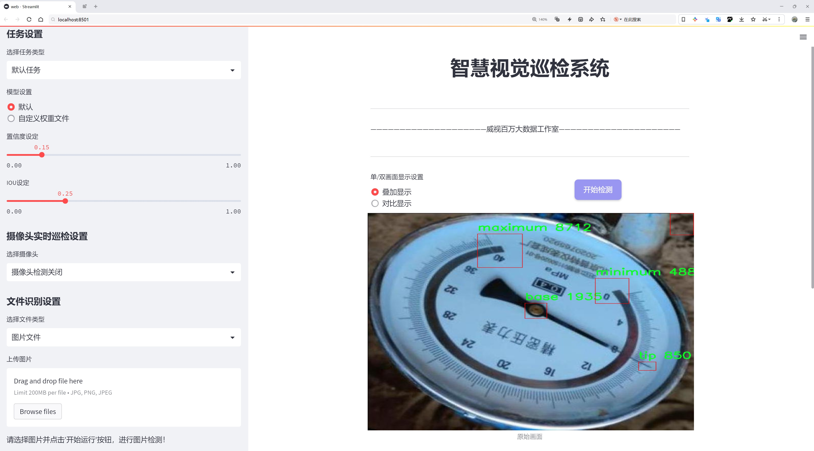
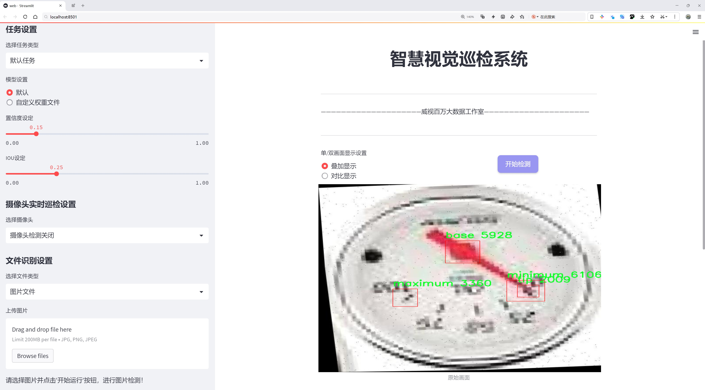
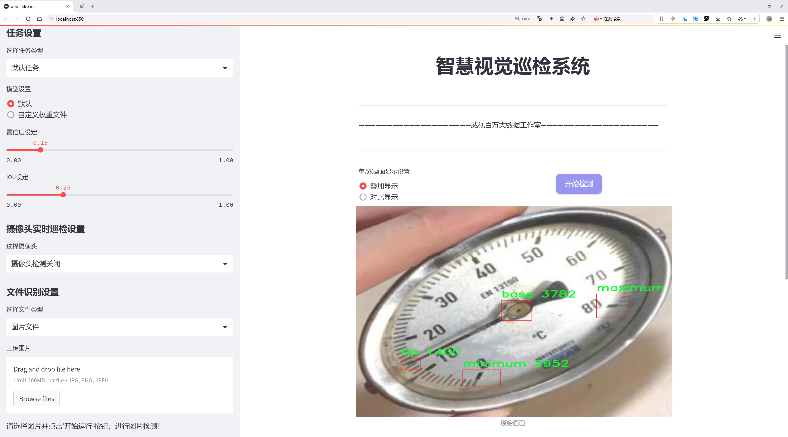
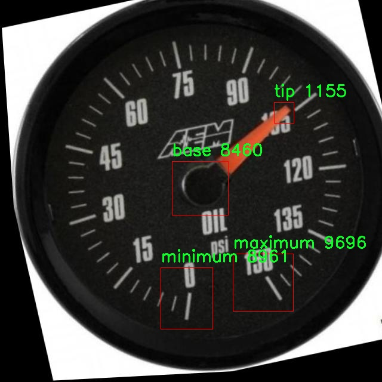
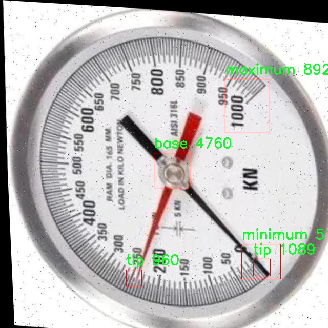
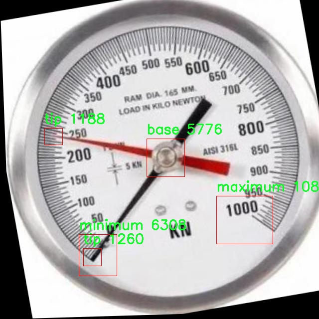
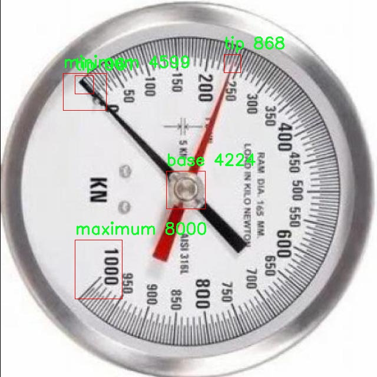
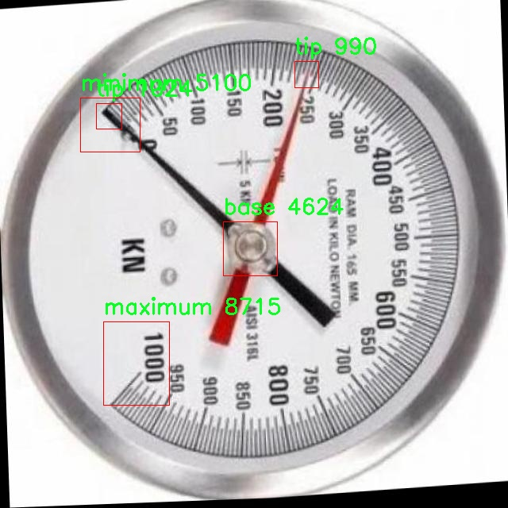

# 指针式仪表关键部位指针量程中心点检测检测系统源码分享
 # [一条龙教学YOLOV8标注好的数据集一键训练_70+全套改进创新点发刊_Web前端展示]

### 1.研究背景与意义

项目参考[AAAI Association for the Advancement of Artificial Intelligence](https://gitee.com/qunshansj/projects)

项目来源[AACV Association for the Advancement of Computer Vision](https://gitee.com/qunmasj/projects)

研究背景与意义

随着工业自动化和智能化的不断发展，指针式仪表在各类设备和系统中的应用愈发广泛。指针式仪表以其直观的显示方式和较高的可靠性，成为监测和控制系统中不可或缺的组成部分。然而，传统的人工读取方式不仅效率低下，而且容易受到人为因素的影响，导致数据的准确性和一致性降低。因此，开发一种高效、准确的自动化检测系统显得尤为重要。

近年来，深度学习技术的迅猛发展为图像识别和物体检测领域带来了革命性的变化。YOLO（You Only Look Once）系列算法因其实时性和高准确率，已成为目标检测领域的主流方法。特别是YOLOv8作为该系列的最新版本，进一步提升了检测精度和速度，适用于多种复杂场景。然而，针对指针式仪表的特定应用场景，现有的YOLOv8模型在关键部位的指针量程中心点检测上仍存在一定的局限性。为此，基于改进YOLOv8的指针式仪表关键部位指针量程中心点检测系统的研究具有重要的理论价值和实际意义。

本研究将基于一个包含4900张图像的数据集，该数据集专注于指针式仪表的关键部位，包括基座、最大值、最小值和指针四个类别。这些类别的细分不仅有助于提高检测的精度，也为后续的分析和应用提供了丰富的数据基础。通过对数据集的深入分析和处理，结合改进的YOLOv8模型，我们旨在实现对指针式仪表关键部位的高效检测与定位，进而提高自动化监测系统的整体性能。

在实际应用中，指针式仪表的准确读取对设备的运行状态监测、故障诊断及安全控制至关重要。通过本研究所开发的检测系统，可以大幅提升仪表数据采集的自动化程度，降低人工干预的需求，从而减少人为错误的发生。此外，该系统还可广泛应用于工业生产、交通运输、能源管理等多个领域，推动相关行业的智能化升级。

综上所述，基于改进YOLOv8的指针式仪表关键部位指针量程中心点检测系统的研究，不仅填补了现有技术在特定应用场景下的空白，也为智能仪表的自动化监测提供了新的解决方案。随着技术的不断进步和应用场景的不断拓展，该系统有望在未来的工业智能化进程中发挥重要作用，推动相关领域的创新与发展。

### 2.图片演示







##### 注意：由于此博客编辑较早，上面“2.图片演示”和“3.视频演示”展示的系统图片或者视频可能为老版本，新版本在老版本的基础上升级如下：（实际效果以升级的新版本为准）

  （1）适配了YOLOV8的“目标检测”模型和“实例分割”模型，通过加载相应的权重（.pt）文件即可自适应加载模型。

  （2）支持“图片识别”、“视频识别”、“摄像头实时识别”三种识别模式。

  （3）支持“图片识别”、“视频识别”、“摄像头实时识别”三种识别结果保存导出，解决手动导出（容易卡顿出现爆内存）存在的问题，识别完自动保存结果并导出到tempDir中。

  （4）支持Web前端系统中的标题、背景图等自定义修改，后面提供修改教程。

  另外本项目提供训练的数据集和训练教程,暂不提供权重文件（best.pt）,需要您按照教程进行训练后实现图片演示和Web前端界面演示的效果。

### 3.视频演示

[3.1 视频演示](https://www.bilibili.com/video/BV1dt4heuEHH/)

### 4.数据集信息展示

##### 4.1 本项目数据集详细数据（类别数＆类别名）

nc: 4
names: ['base', 'maximum', 'minimum', 'tip']


##### 4.2 本项目数据集信息介绍

数据集信息展示

在现代计算机视觉领域，尤其是在目标检测和图像识别的应用中，数据集的构建与选择至关重要。为了有效地训练和改进YOLOv8模型，针对指针式仪表的关键部位指针量程中心点检测系统，我们采用了名为“Analog Dials Details”的数据集。该数据集专门设计用于处理指针式仪表的图像数据，涵盖了多种类型的仪表和指针特征，能够为模型的训练提供丰富的样本和多样化的场景。

“Analog Dials Details”数据集包含四个主要类别，分别是“base”、“maximum”、“minimum”和“tip”。这些类别不仅代表了指针式仪表的不同部分，还反映了仪表在使用过程中的关键特征。具体而言，“base”类别对应仪表的基础部分，通常是指针的固定点或支撑结构，提供了指针运动的参考框架；“maximum”类别则标识了指针所能达到的最大值位置，通常是仪表读数的上限；“minimum”类别则表示指针所能达到的最小值位置，确保在读数时能够准确捕捉到仪表的下限；而“tip”类别则指的是指针的尖端部分，通常是用户读取数据时最为关注的部分。

在数据集的构建过程中，研究团队通过精心挑选和标注了大量的仪表图像，确保每个类别的样本数量充足且多样化。这些图像不仅涵盖了不同类型的指针式仪表，如温度计、压力表和电压表等，还考虑了不同的拍摄角度、光照条件和背景环境，以增强模型的泛化能力。数据集中的每个图像都经过精确的标注，确保模型在训练过程中能够学习到各个类别的特征和位置关系。

此外，为了提高模型的鲁棒性和准确性，数据集还包含了一些带有噪声和干扰的图像。这些图像模拟了实际应用中可能遇到的各种情况，如反射、阴影和模糊等，使得模型在面对真实世界的挑战时能够更好地应对。通过这种方式，数据集不仅为模型提供了理想的训练样本，还为其在复杂环境中的应用奠定了基础。

在使用“Analog Dials Details”数据集进行YOLOv8模型的训练时，研究人员将重点关注模型对不同类别的识别能力，尤其是在指针位置的精确检测上。通过不断迭代和优化，期望最终实现一个高效、准确的指针量程中心点检测系统，为工业自动化、仪表监测等领域提供强有力的技术支持。

总之，“Analog Dials Details”数据集的构建与应用，为指针式仪表的关键部位检测提供了坚实的基础，充分展示了数据集在训练深度学习模型中的重要性。通过对该数据集的深入分析与应用，研究团队希望能够推动指针式仪表检测技术的发展，为相关领域的智能化进程贡献力量。











### 5.全套项目环境部署视频教程（零基础手把手教学）

[5.1 环境部署教程链接（零基础手把手教学）](https://www.ixigua.com/7404473917358506534?logTag=c807d0cbc21c0ef59de5)


[5.2 安装Python虚拟环境创建和依赖库安装视频教程链接（零基础手把手教学）](https://www.ixigua.com/7404474678003106304?logTag=1f1041108cd1f708b01a)

### 6.手把手YOLOV8训练视频教程（零基础小白有手就能学会）

[6.1 手把手YOLOV8训练视频教程（零基础小白有手就能学会）](https://www.ixigua.com/7404477157818401292?logTag=d31a2dfd1983c9668658)

### 7.70+种全套YOLOV8创新点代码加载调参视频教程（一键加载写好的改进模型的配置文件）

[7.1 70+种全套YOLOV8创新点代码加载调参视频教程（一键加载写好的改进模型的配置文件）](https://www.ixigua.com/7404478314661806627?logTag=29066f8288e3f4eea3a4)

### 8.70+种全套YOLOV8创新点原理讲解（非科班也可以轻松写刊发刊，V10版本正在科研待更新）

由于篇幅限制，每个创新点的具体原理讲解就不一一展开，具体见下列网址中的创新点对应子项目的技术原理博客网址【Blog】：


[8.1 70+种全套YOLOV8创新点原理讲解链接](https://gitee.com/qunmasj/good)

### 9.系统功能展示（检测对象为举例，实际内容以本项目数据集为准）

图9.1.系统支持检测结果表格显示

  图9.2.系统支持置信度和IOU阈值手动调节

  图9.3.系统支持自定义加载权重文件best.pt(需要你通过步骤5中训练获得)

  图9.4.系统支持摄像头实时识别

  图9.5.系统支持图片识别

  图9.6.系统支持视频识别

  图9.7.系统支持识别结果文件自动保存

  图9.8.系统支持Excel导出检测结果数据


### 10.原始YOLOV8算法原理

原始YOLOv8算法原理

YOLOv8（You Only Look Once version 8）是目标检测领域的一个重要进展，作为YOLO系列的最新版本，它在前几代模型的基础上进行了多项创新和改进，旨在提升目标检测的准确性和速度。YOLOv8的设计理念强调高效性、灵活性和易用性，使其成为广泛应用于目标检测、图像分割和图像分类任务的理想选择。

YOLOv8的网络结构主要由三部分组成：Backbone、Neck和Head。首先，Backbone负责特征提取，其核心是CSPDarknet（Cross Stage Partial Darknet）结构。该结构将输入图像的特征图分为两个分支，每个分支通过多个残差块进行处理。与前代模型YOLOv5相比，YOLOv8采用了C2f模块替代了C3模块，C2f模块通过引入更多的跳层连接来增强梯度流信息的传递。这种设计不仅提高了特征提取的效率，还确保了模型的轻量化，使得YOLOv8在保持高精度的同时，能够更快地进行推理。

在特征提取的过程中，YOLOv8还引入了快速空间金字塔池化（SPPF）结构，以有效提取不同尺度的特征。这一改进显著减少了模型的参数量和计算量，进一步提升了特征提取的效率。通过这种多尺度特征提取，YOLOv8能够更好地适应各种目标的检测需求，尤其是在复杂场景中，模型能够保持较高的检测性能。

接下来是Neck部分，它的主要功能是将Backbone提取的特征进行处理和压缩。YOLOv8在Neck部分采用了特征金字塔网络（FPN）和路径聚合网络（PAN）的结构，通过多个卷积层和池化层来整合不同层次的特征信息。这种设计不仅提高了特征的表达能力，还增强了模型对小目标的检测能力，使得YOLOv8在多种应用场景中表现出色。

在目标检测的Head部分，YOLOv8引入了无锚框（Anchor-Free）的方法，直接预测目标的中心点和宽高比例。这一创新使得YOLOv8能够减少Anchor框的数量，降低了计算复杂度，同时提高了检测速度和准确度。传统的Anchor-Based方法需要预设大量的锚框，并进行复杂的IoU计算，而YOLOv8通过将目标检测转化为关键点检测，简化了这一过程，提升了模型的泛化能力。

YOLOv8还在损失函数的设计上进行了优化，采用了任务对齐学习（Task Alignment Learning，TAL）的方法，以更好地平衡分类和定位任务的损失。通过引入分类分数和IoU的高次幂乘积作为衡量任务对齐程度的指标，YOLOv8能够更有效地聚焦于标签附近的目标，提高了模型的收敛速度和预测精度。

在训练过程中，YOLOv8采用了Mosaic数据增强技术，以提升模型的鲁棒性和泛化能力。Mosaic增强通过将多张图像拼接成一张新图像，迫使模型学习不同位置和周围像素的特征，从而有效提高了模型的预测精度。然而，YOLOv8在训练的最后阶段停止使用Mosaic增强，以避免对数据真实分布的干扰。

YOLOv8的输入图像尺寸默认为640x640，但在实际应用中，模型支持自适应图像缩放，以提高目标检测和推理的速度。这种自适应缩放方法能够减少信息冗余，确保模型在不同长宽比的图像上都能保持良好的检测性能。

综合来看，YOLOv8通过一系列创新的设计和改进，显著提升了目标检测的准确性和速度。其高效的特征提取、灵活的网络结构和无锚框的检测方式，使得YOLOv8在实际应用中展现出强大的性能，尤其适用于需要实时性和准确性的任务，如自动驾驶、安防监控和机器人视觉等领域。随着YOLOv8的不断发展和应用，未来的目标检测技术将更加智能和高效，为各行各业带来更多的可能性。


### 11.项目核心源码讲解（再也不用担心看不懂代码逻辑）

#### 11.1 70+种YOLOv8算法改进源码大全和调试加载训练教程（非必要）\ultralytics\models\sam\build.py

以下是经过精简和注释的核心代码部分：

```python
import torch
from functools import partial
from ultralytics.utils.downloads import attempt_download_asset
from .modules.decoders import MaskDecoder
from .modules.encoders import ImageEncoderViT, PromptEncoder
from .modules.sam import Sam
from .modules.tiny_encoder import TinyViT
from .modules.transformer import TwoWayTransformer

def build_sam(ckpt='sam_b.pt'):
    """根据指定的检查点构建SAM模型。"""
    model_builder = None
    ckpt = str(ckpt)  # 将ckpt转换为字符串以支持Path类型
    # 遍历可用模型映射，找到对应的构建函数
    for k in sam_model_map.keys():
        if ckpt.endswith(k):
            model_builder = sam_model_map.get(k)

    if not model_builder:
        raise FileNotFoundError(f'{ckpt} 不是一个支持的SAM模型。可用模型有: \n {sam_model_map.keys()}')

    return model_builder(ckpt)

def _build_sam(encoder_embed_dim, encoder_depth, encoder_num_heads, encoder_global_attn_indexes, checkpoint=None, mobile_sam=False):
    """构建所选的SAM模型架构。"""
    prompt_embed_dim = 256  # 提示嵌入维度
    image_size = 1024  # 输入图像大小
    vit_patch_size = 16  # ViT的补丁大小
    image_embedding_size = image_size // vit_patch_size  # 图像嵌入大小

    # 根据是否为移动SAM选择合适的图像编码器
    image_encoder = (TinyViT(...) if mobile_sam else ImageEncoderViT(...))

    # 创建SAM模型
    sam = Sam(
        image_encoder=image_encoder,
        prompt_encoder=PromptEncoder(
            embed_dim=prompt_embed_dim,
            image_embedding_size=(image_embedding_size, image_embedding_size),
            input_image_size=(image_size, image_size),
            mask_in_chans=16,
        ),
        mask_decoder=MaskDecoder(
            num_multimask_outputs=3,
            transformer=TwoWayTransformer(
                depth=2,
                embedding_dim=prompt_embed_dim,
                mlp_dim=2048,
                num_heads=8,
            ),
            transformer_dim=prompt_embed_dim,
            iou_head_depth=3,
            iou_head_hidden_dim=256,
        ),
        pixel_mean=[123.675, 116.28, 103.53],  # 像素均值
        pixel_std=[58.395, 57.12, 57.375],  # 像素标准差
    )

    # 如果提供了检查点，则加载模型权重
    if checkpoint is not None:
        checkpoint = attempt_download_asset(checkpoint)  # 尝试下载检查点
        with open(checkpoint, 'rb') as f:
            state_dict = torch.load(f)  # 加载权重
        sam.load_state_dict(state_dict)  # 将权重加载到模型中

    sam.eval()  # 设置模型为评估模式
    return sam  # 返回构建的SAM模型

# SAM模型映射，便于根据文件名选择相应的构建函数
sam_model_map = {
    'sam_h.pt': build_sam_vit_h,
    'sam_l.pt': build_sam_vit_l,
    'sam_b.pt': build_sam_vit_b,
    'mobile_sam.pt': build_mobile_sam,
}
```

### 代码核心部分说明：
1. **build_sam**: 该函数根据给定的检查点名称构建相应的SAM模型。它会检查模型名称是否在预定义的模型映射中，并调用相应的构建函数。

2. **_build_sam**: 该函数是构建SAM模型的核心逻辑。它根据传入的参数配置图像编码器、提示编码器和掩码解码器，并创建一个完整的SAM模型实例。

3. **模型参数**: 包括编码器的嵌入维度、深度、头数等，这些参数影响模型的复杂性和性能。

4. **权重加载**: 如果提供了检查点路径，模型会尝试下载并加载相应的权重。

5. **模型评估模式**: 最后将模型设置为评估模式，以便在推理时禁用训练特有的行为（如dropout）。

这些核心部分和注释提供了对代码功能的清晰理解，便于后续的维护和扩展。

这个文件是一个用于构建和加载Segment Anything Model（SAM）模型的Python脚本，主要依赖于PyTorch库。首先，文件中引入了一些必要的模块和函数，包括用于下载模型资产的`attempt_download_asset`，以及几个用于构建模型的类，如`MaskDecoder`、`ImageEncoderViT`、`PromptEncoder`、`Sam`和`TinyViT`。

文件中定义了多个函数来构建不同尺寸的SAM模型，包括`build_sam_vit_h`、`build_sam_vit_l`和`build_sam_vit_b`，分别对应高、中、低三个尺寸的模型。这些函数通过调用私有函数`_build_sam`来创建模型，并传入不同的参数，如编码器的嵌入维度、深度、头数和全局注意力索引等。

`_build_sam`函数是模型构建的核心，它根据传入的参数构建一个SAM模型架构。该函数首先定义了一些固定的参数，例如提示嵌入维度、图像大小和补丁大小。接着，根据是否是移动版本的SAM（Mobile-SAM），选择使用`TinyViT`或`ImageEncoderViT`作为图像编码器。之后，创建了`Sam`对象，该对象包括图像编码器、提示编码器和掩码解码器等组件。

在模型构建过程中，如果提供了检查点路径，脚本会尝试下载并加载模型的权重。最后，模型被设置为评估模式，并返回构建好的模型。

文件的最后部分定义了一个字典`samm_model_map`，该字典将模型文件名映射到相应的构建函数。`build_sam`函数则是一个高层接口，允许用户通过指定检查点文件名来构建相应的SAM模型。如果指定的模型不在支持的模型列表中，函数会抛出一个文件未找到的异常。

总体来说，这个文件的主要功能是提供一个灵活的接口来构建和加载不同版本的SAM模型，便于后续的图像分割任务。

#### 11.2 70+种YOLOv8算法改进源码大全和调试加载训练教程（非必要）\ultralytics\hub\session.py

以下是经过简化和注释的核心代码部分：

```python
import signal
import sys
from time import sleep
import requests
from ultralytics.hub.utils import HUB_API_ROOT, HUB_WEB_ROOT, smart_request
from ultralytics.utils import LOGGER, checks
from ultralytics.utils.errors import HUBModelError

class HUBTrainingSession:
    """
    HUB训练会话，用于Ultralytics HUB YOLO模型的管理，包括模型初始化、心跳检测和检查点上传。
    """

    def __init__(self, url):
        """
        初始化HUBTrainingSession，设置模型标识符和相关参数。

        Args:
            url (str): 用于初始化HUB训练会话的模型标识符，可以是URL字符串或特定格式的模型键。
        """
        # 解析输入的模型URL
        if url.startswith(f'{HUB_WEB_ROOT}/models/'):
            url = url.split(f'{HUB_WEB_ROOT}/models/')[-1]
        if [len(x) for x in url.split('_')] == [42, 20]:
            key, model_id = url.split('_')  # 提取密钥和模型ID
        elif len(url) == 20:
            key, model_id = '', url  # 仅提取模型ID
        else:
            raise HUBModelError(f"model='{url}' not found. Check format is correct.")

        # 授权
        auth = Auth(key)
        self.model_id = model_id
        self.api_url = f'{HUB_API_ROOT}/v1/models/{model_id}'
        self.auth_header = auth.get_auth_header()
        self.metrics_queue = {}  # 存储模型指标
        self.model = self._get_model()  # 获取模型数据
        self.alive = True
        self._start_heartbeat()  # 启动心跳检测
        self._register_signal_handlers()  # 注册信号处理器

    def _register_signal_handlers(self):
        """注册信号处理器以优雅地处理终止信号。"""
        signal.signal(signal.SIGTERM, self._handle_signal)
        signal.signal(signal.SIGINT, self._handle_signal)

    def _handle_signal(self, signum, frame):
        """处理终止信号，停止心跳检测并退出程序。"""
        if self.alive:
            LOGGER.info('Kill signal received! ❌')
            self._stop_heartbeat()
            sys.exit(signum)

    def _stop_heartbeat(self):
        """终止心跳检测循环。"""
        self.alive = False

    def upload_metrics(self):
        """上传模型指标到Ultralytics HUB。"""
        payload = {'metrics': self.metrics_queue.copy(), 'type': 'metrics'}
        smart_request('post', self.api_url, json=payload, headers=self.auth_header)

    def _get_model(self):
        """从Ultralytics HUB获取并返回模型数据。"""
        api_url = f'{HUB_API_ROOT}/v1/models/{self.model_id}'
        try:
            response = smart_request('get', api_url, headers=self.auth_header)
            data = response.json().get('data', None)
            if not data:
                raise ValueError('Dataset may still be processing. Please wait a minute and try again.')
            return data
        except requests.exceptions.ConnectionError:
            raise ConnectionRefusedError('ERROR: The HUB server is not online. Please try again later.')

    def upload_model(self, epoch, weights, is_best=False, final=False):
        """
        上传模型检查点到Ultralytics HUB。

        Args:
            epoch (int): 当前训练的轮次。
            weights (str): 模型权重文件的路径。
            is_best (bool): 当前模型是否为最佳模型。
            final (bool): 当前模型是否为最终模型。
        """
        if Path(weights).is_file():
            with open(weights, 'rb') as f:
                file = f.read()
        else:
            LOGGER.warning(f'Missing model {weights}.')
            file = None
        url = f'{self.api_url}/upload'
        data = {'epoch': epoch}
        if final:
            data.update({'type': 'final'})
            smart_request('post', url, data=data, files={'final.pt': file}, headers=self.auth_header)
        else:
            data.update({'type': 'epoch', 'isBest': is_best})
            smart_request('post', url, data=data, files={'last.pt': file}, headers=self.auth_header)

    def _start_heartbeat(self):
        """开始一个线程的心跳循环，定期报告代理的状态到Ultralytics HUB。"""
        while self.alive:
            smart_request('post', f'{HUB_API_ROOT}/v1/agent/heartbeat/models/{self.model_id}',
                          json={'agent': AGENT_NAME}, headers=self.auth_header)
            sleep(300)  # 每300秒发送一次心跳
```

### 代码注释说明：
1. **HUBTrainingSession类**：管理Ultralytics HUB YOLO模型的训练会话，包括模型的初始化、心跳检测和指标上传等功能。
2. **__init__方法**：初始化会话，解析模型URL，进行授权，获取模型数据，并启动心跳检测。
3. **_register_signal_handlers方法**：注册信号处理器，以便在接收到终止信号时能够优雅地停止程序。
4. **upload_metrics方法**：将模型的指标上传到Ultralytics HUB。
5. **_get_model方法**：从Ultralytics HUB获取模型数据，并处理可能的连接错误。
6. **upload_model方法**：上传模型的检查点，包括当前的权重文件和训练轮次。
7. **_start_heartbeat方法**：在一个线程中定期发送心跳请求，报告代理的状态。

这个程序文件是Ultralytics YOLO模型的一个训练会话管理类，名为`HUBTrainingSession`。它的主要功能是处理与Ultralytics HUB的交互，包括模型的初始化、心跳信号的发送和检查点的上传等。

在类的初始化方法中，首先解析传入的模型标识符`url`，并根据其格式提取出模型的`key`和`model_id`。如果输入的格式不正确，则会抛出一个自定义的异常`HUBModelError`。接着，使用`Auth`类进行身份验证，并设置与模型相关的各种属性，如模型的URL、API URL、身份验证头等。同时，定义了一些速率限制，以控制不同API调用的频率。

类中有一个重要的方法`_get_model`，它负责从Ultralytics HUB获取模型数据。如果模型状态为“trained”，则会抛出一个错误，表示模型已经训练完成。如果模型状态为“new”，则会根据返回的数据设置训练参数；如果状态为“training”，则表示需要恢复训练。

该类还实现了心跳机制，通过`_start_heartbeat`方法定期向Ultralytics HUB发送心跳信号，以报告代理的状态。心跳机制是通过一个线程实现的，确保在训练过程中能够持续更新状态。

此外，类中还包含了处理终止信号的方法，确保在接收到终止信号时能够优雅地停止心跳并退出程序。上传模型检查点的功能也被封装在`upload_model`方法中，该方法会将当前训练的模型权重上传到Ultralytics HUB，并根据是否是最佳模型或最终模型进行相应的处理。

总的来说，这个文件实现了YOLO模型训练过程中的重要功能，确保与Ultralytics HUB的顺畅交互，并提供了必要的错误处理和状态管理机制。

#### 11.3 ui.py

```python
import sys
import subprocess

def run_script(script_path):
    """
    使用当前 Python 环境运行指定的脚本。

    Args:
        script_path (str): 要运行的脚本路径

    Returns:
        None
    """
    # 获取当前 Python 解释器的路径
    python_path = sys.executable

    # 构建运行命令
    command = f'"{python_path}" -m streamlit run "{script_path}"'

    # 执行命令
    result = subprocess.run(command, shell=True)
    if result.returncode != 0:
        print("脚本运行出错。")


# 实例化并运行应用
if __name__ == "__main__":
    # 指定您的脚本路径
    script_path = "web.py"  # 这里可以直接指定脚本路径

    # 运行脚本
    run_script(script_path)
```

### 代码注释说明：

1. **导入模块**：
   - `import sys`：导入 sys 模块，用于访问与 Python 解释器相关的变量和函数。
   - `import subprocess`：导入 subprocess 模块，用于执行外部命令。

2. **定义函数 `run_script`**：
   - 该函数接受一个参数 `script_path`，表示要运行的 Python 脚本的路径。
   - 函数内部首先获取当前 Python 解释器的路径（`sys.executable`），然后构建一个命令字符串，用于运行指定的脚本。

3. **构建命令**：
   - 使用格式化字符串将 Python 解释器路径和脚本路径结合，形成完整的命令。

4. **执行命令**：
   - 使用 `subprocess.run` 方法执行构建的命令，并通过 `shell=True` 允许在 shell 中执行。
   - 检查命令执行的返回码，如果不为 0，表示执行出错，打印错误信息。

5. **主程序入口**：
   - 使用 `if __name__ == "__main__":` 确保只有在直接运行该脚本时才会执行以下代码。
   - 指定要运行的脚本路径（这里直接写为 `"web.py"`）。
   - 调用 `run_script` 函数，传入脚本路径以执行该脚本。

这个程序文件名为 `ui.py`，其主要功能是通过当前的 Python 环境运行一个指定的脚本，具体来说是一个名为 `web.py` 的 Streamlit 应用。

首先，程序导入了几个必要的模块，包括 `sys`、`os` 和 `subprocess`。`sys` 模块用于访问与 Python 解释器相关的变量和函数，`os` 模块提供了与操作系统交互的功能，而 `subprocess` 模块则用于创建新进程、连接到它们的输入/输出/错误管道，并获取它们的返回码。

接下来，程序定义了一个名为 `run_script` 的函数，该函数接受一个参数 `script_path`，表示要运行的脚本的路径。在函数内部，首先获取当前 Python 解释器的路径，存储在 `python_path` 变量中。然后，构建一个命令字符串，该命令使用 Streamlit 来运行指定的脚本。具体的命令格式为 `"{python_path}" -m streamlit run "{script_path}"`，这意味着使用当前的 Python 解释器来执行 Streamlit 模块，并运行指定的脚本。

接着，使用 `subprocess.run` 方法执行构建好的命令。该方法的 `shell=True` 参数表示命令将在一个新的 shell 中执行。执行后，程序检查返回码 `result.returncode`，如果返回码不为 0，表示脚本运行过程中出现了错误，此时程序会打印出“脚本运行出错。”的提示信息。

在文件的最后部分，使用 `if __name__ == "__main__":` 语句来确保只有在直接运行该脚本时才会执行以下代码。此处指定了要运行的脚本路径，调用 `abs_path` 函数获取 `web.py` 的绝对路径，并将其传递给 `run_script` 函数以启动脚本的执行。

总体来说，这个程序的作用是简化了通过命令行运行 Streamlit 应用的过程，用户只需运行 `ui.py`，就可以自动启动 `web.py` 脚本。

#### 11.4 train.py

以下是经过简化和注释的核心代码部分：

```python
import random
import numpy as np
import torch.nn as nn
from ultralytics.data import build_dataloader, build_yolo_dataset
from ultralytics.engine.trainer import BaseTrainer
from ultralytics.models import yolo
from ultralytics.nn.tasks import DetectionModel
from ultralytics.utils import LOGGER, RANK
from ultralytics.utils.torch_utils import de_parallel, torch_distributed_zero_first

class DetectionTrainer(BaseTrainer):
    """
    基于检测模型的训练类，继承自BaseTrainer类。
    """

    def build_dataset(self, img_path, mode="train", batch=None):
        """
        构建YOLO数据集。

        参数:
            img_path (str): 图像文件夹的路径。
            mode (str): 模式，可以是'train'或'val'，用于自定义不同的增强方法。
            batch (int, optional): 批次大小，默认为None。
        """
        gs = max(int(de_parallel(self.model).stride.max() if self.model else 0), 32)  # 获取模型的最大步幅
        return build_yolo_dataset(self.args, img_path, batch, self.data, mode=mode, rect=mode == "val", stride=gs)

    def get_dataloader(self, dataset_path, batch_size=16, rank=0, mode="train"):
        """构建并返回数据加载器。"""
        assert mode in ["train", "val"]  # 确保模式合法
        with torch_distributed_zero_first(rank):  # 仅在DDP中初始化数据集
            dataset = self.build_dataset(dataset_path, mode, batch_size)  # 构建数据集
        shuffle = mode == "train"  # 训练模式下打乱数据
        workers = self.args.workers if mode == "train" else self.args.workers * 2  # 根据模式设置工作线程数
        return build_dataloader(dataset, batch_size, workers, shuffle, rank)  # 返回数据加载器

    def preprocess_batch(self, batch):
        """对图像批次进行预处理，包括缩放和转换为浮点数。"""
        batch["img"] = batch["img"].to(self.device, non_blocking=True).float() / 255  # 将图像转换为浮点数并归一化
        if self.args.multi_scale:  # 如果启用多尺度
            imgs = batch["img"]
            sz = (
                random.randrange(self.args.imgsz * 0.5, self.args.imgsz * 1.5 + self.stride)
                // self.stride
                * self.stride
            )  # 随机选择新的尺寸
            sf = sz / max(imgs.shape[2:])  # 计算缩放因子
            if sf != 1:
                ns = [
                    math.ceil(x * sf / self.stride) * self.stride for x in imgs.shape[2:]
                ]  # 计算新的形状
                imgs = nn.functional.interpolate(imgs, size=ns, mode="bilinear", align_corners=False)  # 进行插值缩放
            batch["img"] = imgs  # 更新批次图像
        return batch

    def get_model(self, cfg=None, weights=None, verbose=True):
        """返回YOLO检测模型。"""
        model = DetectionModel(cfg, nc=self.data["nc"], verbose=verbose and RANK == -1)  # 创建检测模型
        if weights:
            model.load(weights)  # 加载权重
        return model

    def plot_training_samples(self, batch, ni):
        """绘制训练样本及其注释。"""
        plot_images(
            images=batch["img"],
            batch_idx=batch["batch_idx"],
            cls=batch["cls"].squeeze(-1),
            bboxes=batch["bboxes"],
            paths=batch["im_file"],
            fname=self.save_dir / f"train_batch{ni}.jpg",
            on_plot=self.on_plot,
        )
```

### 代码注释说明：
1. **导入模块**：导入必要的库和模块，包括数据处理、模型构建和工具函数。
2. **DetectionTrainer类**：定义一个用于训练YOLO检测模型的类，继承自`BaseTrainer`。
3. **build_dataset方法**：构建YOLO数据集，支持训练和验证模式，返回数据集对象。
4. **get_dataloader方法**：构建数据加载器，确保在分布式训练中只初始化一次数据集。
5. **preprocess_batch方法**：对输入的图像批次进行预处理，包括归一化和可能的多尺度调整。
6. **get_model方法**：返回一个YOLO检测模型实例，并可选择加载预训练权重。
7. **plot_training_samples方法**：绘制训练样本及其注释，便于可视化训练过程。

这个程序文件 `train.py` 是一个用于训练 YOLO（You Only Look Once）目标检测模型的实现，继承自 `BaseTrainer` 类。程序的主要功能是构建数据集、加载数据、预处理图像、设置模型属性、获取模型、验证模型、记录损失、绘制训练样本和指标等。

首先，程序导入了必要的库和模块，包括数学运算、随机数生成、深度学习相关的库（如 PyTorch）以及 YOLO 相关的工具和函数。接着定义了 `DetectionTrainer` 类，该类主要负责训练目标检测模型。

在 `build_dataset` 方法中，程序根据传入的图像路径和模式（训练或验证）构建 YOLO 数据集。它会调用 `build_yolo_dataset` 函数，并根据模型的步幅（stride）来设置数据集的参数。

`get_dataloader` 方法用于构建并返回数据加载器。它会检查模式是否为训练或验证，并在分布式训练的情况下，确保数据集只初始化一次。该方法还会根据模式设置是否打乱数据顺序，并根据工作线程数构建数据加载器。

`preprocess_batch` 方法对一批图像进行预处理，包括将图像缩放到合适的大小并转换为浮点数格式。若启用了多尺度训练，程序会随机选择图像大小，并根据比例调整图像的尺寸。

`set_model_attributes` 方法用于设置模型的属性，包括类别数量和类别名称。这些信息会被附加到模型中，以便后续训练使用。

`get_model` 方法返回一个 YOLO 检测模型，并可选择加载预训练权重。`get_validator` 方法则返回一个用于验证模型的验证器，主要用于计算损失和评估模型性能。

`label_loss_items` 方法返回一个包含标记训练损失项的字典，方便后续记录和分析训练过程中的损失情况。

`progress_string` 方法生成一个格式化的字符串，用于显示训练进度，包括当前的轮次、GPU 内存使用情况、损失值、实例数量和图像大小等信息。

`plot_training_samples` 方法用于绘制训练样本及其标注，便于可视化训练数据的质量。`plot_metrics` 方法则从 CSV 文件中绘制训练指标，生成结果图像以便分析训练效果。最后，`plot_training_labels` 方法创建一个带标签的训练图，展示训练集中所有的边界框和类别信息。

总体而言，这个文件实现了 YOLO 模型训练的核心功能，提供了数据处理、模型训练和结果可视化等一系列功能，使得用户能够方便地进行目标检测模型的训练和评估。

#### 11.5 70+种YOLOv8算法改进源码大全和调试加载训练教程（非必要）\ultralytics\nn\tasks.py

以下是代码中最核心的部分，并附上详细的中文注释：

```python
import torch
import torch.nn as nn

class BaseModel(nn.Module):
    """BaseModel类是Ultralytics YOLO系列模型的基类。"""

    def forward(self, x, *args, **kwargs):
        """
        模型的前向传播方法，处理单个尺度的输入。

        参数:
            x (torch.Tensor | dict): 输入图像张量或包含图像张量和真实标签的字典。

        返回:
            (torch.Tensor): 网络的输出。
        """
        if isinstance(x, dict):  # 处理训练和验证时的情况
            return self.loss(x, *args, **kwargs)  # 计算损失
        return self.predict(x, *args, **kwargs)  # 进行预测

    def predict(self, x, profile=False, visualize=False, augment=False):
        """
        通过网络进行前向传播。

        参数:
            x (torch.Tensor): 输入张量。
            profile (bool): 如果为True，打印每层的计算时间，默认为False。
            visualize (bool): 如果为True，保存模型的特征图，默认为False。
            augment (bool): 在预测时进行图像增强，默认为False。

        返回:
            (torch.Tensor): 模型的最后输出。
        """
        if augment:
            return self._predict_augment(x)  # 进行增强预测
        return self._predict_once(x, profile, visualize)  # 进行一次预测

    def _predict_once(self, x, profile=False, visualize=False):
        """
        执行一次前向传播。

        参数:
            x (torch.Tensor): 输入张量。
            profile (bool): 如果为True，打印每层的计算时间，默认为False。
            visualize (bool): 如果为True，保存模型的特征图，默认为False。

        返回:
            (torch.Tensor): 模型的最后输出。
        """
        y, dt = [], []  # 输出列表和时间列表
        for m in self.model:  # 遍历模型中的每一层
            if m.f != -1:  # 如果不是来自前一层
                x = y[m.f] if isinstance(m.f, int) else [x if j == -1 else y[j] for j in m.f]  # 从早期层获取输入
            if profile:
                self._profile_one_layer(m, x, dt)  # 进行单层性能分析
            x = m(x)  # 执行前向传播
            y.append(x if m.i in self.save else None)  # 保存输出
            if visualize:
                feature_visualization(x, m.type, m.i, save_dir=visualize)  # 可视化特征图
        return x  # 返回最后的输出

    def loss(self, batch, preds=None):
        """
        计算损失。

        参数:
            batch (dict): 用于计算损失的批次数据。
            preds (torch.Tensor | List[torch.Tensor]): 预测结果。

        返回:
            (torch.Tensor): 计算得到的损失值。
        """
        if not hasattr(self, 'criterion'):
            self.criterion = self.init_criterion()  # 初始化损失函数

        preds = self.forward(batch['img']) if preds is None else preds  # 获取预测结果
        return self.criterion(preds, batch)  # 计算损失

    def init_criterion(self):
        """初始化BaseModel的损失标准。"""
        raise NotImplementedError('compute_loss() needs to be implemented by task heads')  # 抛出未实现异常


class DetectionModel(BaseModel):
    """YOLOv8检测模型。"""

    def __init__(self, cfg='yolov8n.yaml', ch=3, nc=None, verbose=True):
        """使用给定的配置和参数初始化YOLOv8检测模型。"""
        super().__init__()  # 调用父类构造函数
        self.yaml = cfg if isinstance(cfg, dict) else yaml_model_load(cfg)  # 加载配置字典

        # 定义模型
        ch = self.yaml['ch'] = self.yaml.get('ch', ch)  # 输入通道
        if nc and nc != self.yaml['nc']:
            self.yaml['nc'] = nc  # 覆盖YAML中的类别数
        self.model, self.save = parse_model(deepcopy(self.yaml), ch=ch, verbose=verbose)  # 解析模型
        self.names = {i: f'{i}' for i in range(self.yaml['nc'])}  # 默认名称字典

        # 初始化权重和偏置
        initialize_weights(self)

    def init_criterion(self):
        """初始化DetectionModel的损失标准。"""
        return v8DetectionLoss(self)  # 返回YOLOv8检测损失实例
```

以上代码是YOLO模型的核心部分，包含了模型的前向传播、损失计算以及模型初始化等关键功能。每个方法都有详细的中文注释，帮助理解其功能和用途。

这个程序文件是Ultralytics YOLOv8模型的核心实现之一，主要负责模型的定义、前向传播、损失计算以及模型的加载等功能。文件中包含了多个类和函数，下面对其进行逐一说明。

首先，文件导入了一些必要的库和模块，包括PyTorch、Ultralytics自定义的模块以及一些工具函数。文件的主要类是`BaseModel`，它是所有YOLO模型的基类，提供了基本的前向传播方法和损失计算的框架。`BaseModel`类中定义了多个方法，如`forward`、`predict`、`loss`等，分别用于执行前向传播、进行预测和计算损失。

在`BaseModel`类中，`forward`方法会根据输入的类型（图像张量或字典）选择不同的处理方式。如果输入是字典，通常用于训练过程，则调用`loss`方法计算损失；如果是图像张量，则调用`predict`方法进行预测。`predict`方法又调用了`_predict_once`，在该方法中，模型会逐层进行前向传播，并可以选择是否进行时间性能分析和特征可视化。

此外，`BaseModel`还提供了模型融合、参数初始化、模型信息打印等功能。模型融合是通过将卷积层和批归一化层合并来提高计算效率。

接下来，文件中定义了多个具体的模型类，如`DetectionModel`、`SegmentationModel`、`PoseModel`和`ClassificationModel`，它们分别对应于目标检测、分割、姿态估计和分类任务。这些类继承自`BaseModel`，并在构造函数中根据配置文件初始化模型结构和参数。

例如，`DetectionModel`类的构造函数会解析配置文件，定义模型的结构，并根据输入通道数和类别数进行初始化。`SegmentationModel`和`PoseModel`类在此基础上进一步扩展，分别实现了分割和姿态估计的特定功能。

文件中还定义了一个`Ensemble`类，用于实现模型的集成，允许将多个模型的输出结合起来，以提高预测的准确性。

此外，文件中包含了一些实用的函数，如`torch_safe_load`用于安全加载模型权重，`attempt_load_weights`和`attempt_load_one_weight`用于加载单个或多个模型的权重，`parse_model`用于解析模型的配置并构建相应的PyTorch模型。

最后，文件还包含了一些辅助函数，如`yaml_model_load`用于从YAML文件加载模型配置，`guess_model_scale`和`guess_model_task`用于根据模型路径或配置推测模型的规模和任务类型。

总的来说，这个文件实现了YOLOv8模型的基础架构，提供了灵活的模型定义和训练功能，是YOLOv8系列模型的重要组成部分。

#### 11.6 70+种YOLOv8算法改进源码大全和调试加载训练教程（非必要）\ultralytics\nn\extra_modules\ops_dcnv3\modules\dcnv3.py

以下是代码中最核心的部分，并附上详细的中文注释：

```python
import torch
from torch import nn
import torch.nn.functional as F

class DCNv3(nn.Module):
    def __init__(self,
                 channels=64,
                 kernel_size=3,
                 stride=1,
                 pad=1,
                 dilation=1,
                 group=4,
                 offset_scale=1.0,
                 center_feature_scale=False,
                 remove_center=False):
        """
        DCNv3模块的初始化函数
        :param channels: 输入通道数
        :param kernel_size: 卷积核大小
        :param stride: 步幅
        :param pad: 填充
        :param dilation: 膨胀
        :param group: 分组数
        :param offset_scale: 偏移缩放因子
        :param center_feature_scale: 是否使用中心特征缩放
        :param remove_center: 是否移除中心
        """
        super().__init__()
        if channels % group != 0:
            raise ValueError(f'channels必须能被group整除, 但得到的是 {channels} 和 {group}')
        
        self.channels = channels
        self.kernel_size = kernel_size
        self.stride = stride
        self.dilation = dilation
        self.pad = pad
        self.group = group
        self.group_channels = channels // group
        self.offset_scale = offset_scale
        self.center_feature_scale = center_feature_scale
        self.remove_center = int(remove_center)

        # 定义偏移量和掩码的线性层
        self.offset = nn.Linear(channels, group * (kernel_size * kernel_size - remove_center) * 2)
        self.mask = nn.Linear(channels, group * (kernel_size * kernel_size - remove_center))
        self.input_proj = nn.Linear(channels, channels)  # 输入投影层
        self.output_proj = nn.Linear(channels, channels)  # 输出投影层
        self._reset_parameters()  # 初始化参数

        if center_feature_scale:
            self.center_feature_scale_proj_weight = nn.Parameter(torch.zeros((group, channels), dtype=torch.float))
            self.center_feature_scale_proj_bias = nn.Parameter(torch.tensor(0.0, dtype=torch.float).view((1,)).repeat(group, ))

    def _reset_parameters(self):
        """重置网络参数"""
        nn.init.constant_(self.offset.weight.data, 0.)
        nn.init.constant_(self.offset.bias.data, 0.)
        nn.init.constant_(self.mask.weight.data, 0.)
        nn.init.constant_(self.mask.bias.data, 0.)
        nn.init.xavier_uniform_(self.input_proj.weight.data)
        nn.init.constant_(self.input_proj.bias.data, 0.)
        nn.init.xavier_uniform_(self.output_proj.weight.data)
        nn.init.constant_(self.output_proj.bias.data, 0.)

    def forward(self, input):
        """
        前向传播函数
        :param input: 输入张量 (N, H, W, C)
        :return: 输出张量 (N, H, W, C)
        """
        N, H, W, _ = input.shape  # 获取输入的形状

        x = self.input_proj(input)  # 输入投影
        x_proj = x  # 保存投影后的输入用于后续计算

        x1 = input.permute(0, 3, 1, 2)  # 将输入的通道维度移到前面
        x1 = self.dw_conv(x1).permute(0, 2, 3, 1)  # 深度卷积操作
        offset = self.offset(x1)  # 计算偏移量
        mask = self.mask(x1).reshape(N, H, W, self.group, -1)  # 计算掩码
        mask = F.softmax(mask, -1)  # 对掩码进行softmax处理

        # 使用DCNv3函数进行卷积操作
        x = DCNv3Function.apply(
            x, offset, mask,
            self.kernel_size, self.kernel_size,
            self.stride, self.stride,
            self.pad, self.pad,
            self.dilation, self.dilation,
            self.group, self.group_channels,
            self.offset_scale,
            256,
            self.remove_center)

        # 如果启用中心特征缩放
        if self.center_feature_scale:
            center_feature_scale = self.center_feature_scale_module(
                x1, self.center_feature_scale_proj_weight, self.center_feature_scale_proj_bias)
            center_feature_scale = center_feature_scale[..., None].repeat(
                1, 1, 1, 1, self.channels // self.group).flatten(-2)
            x = x * (1 - center_feature_scale) + x_proj * center_feature_scale  # 加权融合

        x = self.output_proj(x)  # 输出投影
        return x  # 返回输出
```

### 代码核心部分说明：
1. **DCNv3类**：实现了深度可分离卷积的主要功能，包括初始化参数、前向传播等。
2. **参数初始化**：通过 `_reset_parameters` 方法初始化各个线性层的权重和偏置。
3. **前向传播**：在 `forward` 方法中，输入经过线性投影、深度卷积、偏移量和掩码的计算，最终输出结果。
4. **中心特征缩放**：可选的特征缩放机制，用于调整输出特征。

这段代码的核心功能是实现一个深度可分离卷积模块，并支持可选的特征缩放，适用于各种深度学习任务。

这个程序文件是实现了DCNv3（Deformable Convolutional Networks v3）模块的PyTorch代码，主要用于深度学习中的卷积操作，特别是在目标检测和图像分割等任务中。代码中定义了多个类和函数，下面是对其主要内容的说明。

首先，文件引入了一些必要的库，包括PyTorch的核心模块和一些功能模块。接着，定义了两个类`to_channels_first`和`to_channels_last`，用于在不同的通道格式之间进行转换。`to_channels_first`将输入张量的通道维度移到第二维，而`to_channels_last`则将通道维度移到最后一维。这种转换在处理不同格式的输入时非常有用。

接下来，`build_norm_layer`函数用于构建归一化层，支持批归一化（Batch Normalization）和层归一化（Layer Normalization），并根据输入和输出格式进行通道格式的转换。`build_act_layer`函数则用于构建激活函数层，支持ReLU、SiLU和GELU等激活函数。

`_is_power_of_2`函数用于检查一个数是否是2的幂，这在优化CUDA实现时非常重要。

`CenterFeatureScaleModule`类用于实现中心特征缩放模块，主要通过线性变换和sigmoid激活函数来计算中心特征缩放。

`DCNv3_pytorch`类是DCNv3模块的主要实现。构造函数中定义了各种参数，包括通道数、卷积核大小、步幅、填充、扩张率、分组数等，并初始化了各个层。该类的`forward`方法实现了DCNv3的前向传播过程，包括输入的线性变换、深度卷积、偏移量和掩码的计算，以及通过自定义的`dcnv3_core_pytorch`函数进行的可变形卷积操作。如果启用了中心特征缩放，则还会计算并应用该缩放。

`DCNv3`类是DCNv3模块的另一种实现，主要区别在于使用了自定义的卷积层`Conv`。它的构造函数和前向传播方法与`DCNv3_pytorch`类似，提供了相同的功能。

最后，`DCNv3_DyHead`类是DCNv3模块的动态头实现，主要用于处理特定的输入和输出格式。它的前向传播方法与DCNv3类似，但只包含输出投影。

整体来看，这个文件实现了DCNv3模块的核心功能，提供了灵活的构造和前向传播方法，适用于各种深度学习任务，尤其是在处理复杂的图像数据时。通过可变形卷积，模型能够更好地适应输入数据的形状和特征，从而提高性能。

### 12.系统整体结构（节选）

### 整体功能和架构概括

该程序库是一个完整的YOLOv8目标检测框架，包含了模型构建、训练、验证、推理和可视化等功能。它支持多种YOLOv8算法的改进和扩展，提供了灵活的接口和模块化的设计，使得用户可以方便地进行模型训练和调试。整体架构由多个模块组成，每个模块负责特定的功能，如模型构建、数据处理、训练管理、损失计算和自定义操作等。

### 文件功能整理表

| 文件路径                                                                 | 功能描述                                                         |
|------------------------------------------------------------------------|----------------------------------------------------------------|
| `ultralytics/models/sam/build.py`                                     | 构建和加载Segment Anything Model（SAM），提供不同尺寸的模型构建接口。 |
| `ultralytics/hub/session.py`                                          | 管理与Ultralytics HUB的训练会话，包括模型加载、心跳信号和检查点上传。  |
| `ui.py`                                                                | 启动Streamlit应用程序，简化运行指定脚本的过程。                      |
| `train.py`                                                             | 实现YOLO模型的训练过程，包括数据集构建、模型训练和损失记录等功能。   |
| `ultralytics/nn/tasks.py`                                             | 定义YOLO模型的基础架构，处理前向传播、损失计算和模型加载等功能。      |
| `ultralytics/nn/extra_modules/ops_dcnv3/modules/dcnv3.py`           | 实现DCNv3模块，提供可变形卷积操作，增强模型对输入特征的适应能力。      |
| `ultralytics/utils/patches.py`                                        | 提供一些工具函数和补丁，可能用于模型的兼容性和功能扩展。              |
| `chinese_name_list.py`                                                | 可能包含中文名称列表，用于数据处理或可视化。                         |
| `ultralytics/models/yolo/detect/__init__.py`                         | YOLO检测模块的初始化文件，负责导入和组织YOLO相关的功能。             |
| `ultralytics/engine/validator.py`                                     | 实现模型验证功能，计算损失和评估模型性能。                          |
| `ultralytics/models/nas/val.py`                                       | 处理神经架构搜索（NAS）相关的验证过程。                             |
| `ultralytics/nn/__init__.py`                                          | 神经网络模块的初始化文件，负责导入和组织网络相关的功能。             |
| `ultralytics/utils/ops.py`                                            | 提供一些操作相关的工具函数，可能用于模型训练和推理过程中的辅助功能。  |

以上表格总结了各个文件的主要功能，展示了YOLOv8框架的模块化设计和各个组件之间的关系。

注意：由于此博客编辑较早，上面“11.项目核心源码讲解（再也不用担心看不懂代码逻辑）”中部分代码可能会优化升级，仅供参考学习，完整“训练源码”、“Web前端界面”和“70+种创新点源码”以“13.完整训练+Web前端界面+70+种创新点源码、数据集获取”的内容为准。

### 13.完整训练+Web前端界面+70+种创新点源码、数据集获取


# [下载链接：https://mbd.pub/o/bread/ZpuTmJds](https://mbd.pub/o/bread/ZpuTmJds)